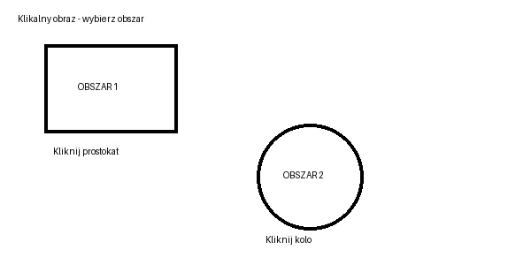

# HTML

**HTML** **(HyperText Markup Language)** to **język znaczników używany do tworzenia struktury stron** internetowych. **Nie jest językiem programowania** — opisuje, co znajduje się na stronie: nagłówki, tekst, obrazy, linki, formularze, tabele itd.

## Podstawowa budowa dokumentu HTML

```html
<!DOCTYPE html>
<html lang="pl">

<head>
    <meta charset="UTF-8">
    <!--Poniższy znacznik mówi przeglądarce mobilnej, jak ma wyświetlać stronę na ekranie telefonu lub tabletu. -->
    <meta name="viewport" content="width=device-width, initial-scale=1.0">
    <!--
    name="viewport"    - pozwala poprawnie wyświetlać responsywną stronę na urządzeniach mobilnych. Ustawia szerokość viewportu równą szerokości urządzenia
    width=device-width - szerokość strony ma odpowiadać szerokości ekranu urządzenia. Jeśli telefon ma węższy ekran, przeglądarka dopasuje obszar strony do tej szerokości.
    initial-scale=1.0  - strona ma być wyświetlana bez początkowego powiększenia lub pomniejszenia (skala startowa wynosi 100%)

    
    -->
    <title>Moja pierwsza strona</title>
</head>

<body>

    <h1>Moja pierwsza strona HTML</h1>

    <p>Uczę się języka HTML.</p>

</body>

</html>
```

| Znacznik          | Znaczenie                                                                                                                                     |
| ----------------- | ----------------------------------------------------------------------------------------------------------------------------------------------|
| `<!DOCTYPE html>` | informuje przeglądarkę, że dokument jest napisany w HTML5. Dzięki temu przeglądarka wie, jak poprawnie interpretować i wyświetlać stronę.     |
| `<html>`          | główny element całej strony                                                                                                                   |
| `<head>`          | informacje o stronie niewidoczne bezpośrednio na stronie                                                                                      |
| `<base>`          | ustawia podstawowy adres URL dla wszystkich względnych linków i ścieżek w dokumencie                                                          |
| `<link>`          | służy do dołączania zewnętrznych zasobów, np. pliku CSS                                                                                       |
| `<meta>`          | dodatkowe informacje o dokumencie                                                                                                             |
| `<title>`         | tytuł widoczny na karcie przeglądarki                                                                                                         |
| `<style>`         | pozwala zapisać kod CSS bezpośrednio w dokumencie HTML                                                                                        |    
| `<body>`          | zawartość strony widoczna dla użytkownika                                                                                                     |


Inne wartości dla atrybutu `content` w znaczniku `meta`:

| Ustawienie      | Przykład             | Znaczenie                                                                      |
| --------------- | -------------------- | ------------------------------------------------------------------------------ |
| `width`         | `width=device-width` | Ustawia szerokość viewportu równą szerokości urządzenia                        |
| `width`         | `width=980`          | Ustawia konkretną szerokość viewportu, np. 980 px                              |
| `initial-scale` | `initial-scale=1.0`  | Początkowy poziom powiększenia strony                                          |
| `minimum-scale` | `minimum-scale=0.5`  | Najmniejsze dozwolone pomniejszenie                                            |
| `maximum-scale` | `maximum-scale=3.0`  | Największe dozwolone powiększenie                                              |
| `user-scalable` | `user-scalable=yes`  | Pozwala użytkownikowi powiększać stronę                                        |
| `user-scalable` | `user-scalable=no`   | Blokuje ręczne powiększanie strony                                             |
| `viewport-fit`  | `viewport-fit=cover` | Pozwala stronie wykorzystać cały ekran, również obszary przy wycięciach ekranu |


## Podstawowe znaczniki HTML

### Nagłówki

HTML posiada 6 poziomów nagłówków:
```html
<h1>Nagłówek poziomu 1</h1>
<h2>Nagłówek poziomu 2</h2>
<h3>Nagłówek poziomu 3</h3>
<h4>Nagłówek poziomu 4</h4>
<h5>Nagłówek poziomu 5</h5>
<h6>Nagłówek poziomu 6</h6>
```
`<h1>` jest najważniejszym nagłówkiem, a `<h6>` najmniej ważnym.
Na stronie zwykle mamy jeden główny `<h1>`.

### Akapit

Do tworzenia akapitów służy:
```html
<p>To jest pierwszy akapit tekstu.</p>

<p>To jest drugi akapit tekstu.</p>
```
`<p>` pochodzi od angielskiego paragraph.

### Przejście do nowej linii
```html
Jan Kowalski<br>
ul. Kwiatowa 10<br>
00-001 Warszawa
```
`<br>` oznacza line break, czyli złamanie linii.

Nie wymaga znacznika zamykającego.

### Linia pozioma
```html
<p>Pierwsza część strony</p>
<hr>
<p>Druga część strony</p>
```
`<hr>` tworzy poziomą linię oddzielającą treść.

### Pogrubienie tekstu

Najczęściej:
```html
<strong>Ważna informacja</strong>
```
Można również spotkać:
```html
<b>Pogrubiony tekst</b>
```
Różnica jest semantyczna. `<strong>` oznacza, że tekst jest ważny, natomiast `<b>` przede wszystkim wyróżnia go wizualnie.

### Kursywa
```html
<em>Ten tekst jest zaakcentowany.</em>
```
lub:
```html
<i>Ten tekst jest zapisany kursywą.</i>
```
`<em>` oznacza zaakcentowanie lub podkreślenie znaczenia tekstu. Ma znaczenie semantyczne, a wiec oznacza, że znacznik przekazuje informację o znaczeniu treści, a nie tylko o jej wyglądzie.
`<i>` oznacza głównie wyróżnienie tekstu stylistycznie, np. termin, obce słowo lub nazwę, bez sugerowania szczególnego nacisku.

### Podkreślenie
```html
<u>Podkreślony tekst</u>
```
### Indeks górny

Przydatny np. w matematyce:
```html
2<sup>3</sup> = 8
```
Rezultat: 2³ = 8

### Indeks dolny

Przydatny np. w chemii:
```html
H<sub>2</sub>O
```
Rezultat: H₂O

### Tekst przekreślony
Oznacza tekst, który nie jest już aktualny lub prawdziwy.
```html
<s>Przekreślony tekst</s>
```

### Tekst poboczny
Oznacza tekst poboczny, np. drobny druk, informację dodatkową, prawa autorskie. Przeglądarki zwykle wyświetlają go mniejszą czcionką.
```html
<small>small </small>
```

### Tytuł
Oznacza tytuł dzieła, np. książki, filmu, artykułu, obrazu.
```html
<cite>Tytuł książki</cite>
```
### Cytat
Oznacza krótki cytat wewnątrz tekstu. Przeglądarka zazwyczaj sama dodaje cudzysłowy.
```html
<q> cytat wewnątrz tekstu </q>
```
### `<dfn>`
Oznacza termin, który jest właśnie definiowany.
```html
    <p>
        <dfn>HTML</dfn>
        jest językiem znaczników służącym do tworzenia struktury stron internetowych.
    </p>
```
### `<abbr>`

```html
<p>
    Uczymy się <abbr title="HyperText Markup Language">HTML</abbr>.
</p>
```
### `<ruby>` , `<rt>`, `<rp>` 

```html

    <!-- ruby, rt, rp -->
    <p>
        Przykład japońskiego zapisu:

        <ruby>
            日本
            <rp>(</rp>
            <rt>にほん</rt>
            <rp>)</rp>
        </ruby>

    </p>


    <!--
        rb - znacznik przestarzały. Nie stosować w nowych projektach.
    -->

    <p>
        Przykład starego zapisu z rb:

        <ruby>
            <rb>漢字</rb>
            <rt>かんじ</rt>
        </ruby>
    </p>


    <!--
        rtc - znacznik przestarzały. Nie stosować w nowych projektach.
    -->

    <p>
        Przykład starego zapisu z rtc:

        <ruby>
            <rb>漢字</rb>

            <rtc>
                <rt>かんじ</rt>
            </rtc>
        </ruby>
    </p>
```


### Linki

Do tworzenia linków służy znacznik `<a>`:
```html
<a href="https://github.com/KasiaKasia">Kasia</a>
```
Najczęściej używane atrybuty znacznika `<a>`:

| Atrybut    | Przykładowa wartość        | Znaczenie                                                                                      |
| ---------- | -------------------------- | ---------------------------------------------------------------------------------------------- |
| `href`     | `"https://www.google.com"` | Określa adres, do którego prowadzi link.                                                       |
| `target`   | `"_blank"`                 | Określa, gdzie ma zostać otwarty link.                                                         |
| `rel`      | `"noopener noreferrer"`    | Określa relację między bieżącą stroną a stroną docelową; często stosowany z `target="_blank"`. |
| `title`    | `"Przejdź do Google"`      | Dodatkowa informacja o linku, zwykle widoczna po najechaniu kursorem.                          |
| `download` | `"plik.pdf"`               | Powoduje pobranie wskazanego pliku zamiast jego otwarcia.                                      |
| `hreflang` | `"en"`                     | Informuje, w jakim języku jest strona, do której prowadzi link.                                |
| `type`     | `"application/pdf"`        | Informuje o typie zasobu, do którego prowadzi link.                                            |

Atrybut `target`
Najczęściej używane wartości:

| Wartość   | Znaczenie                                                    |
| --------- | ------------------------------------------------------------ |
| `_self`   | Otwiera link w tej samej karcie — wartość domyślna.          |
| `_blank`  | Otwiera link w nowej karcie lub oknie.                       |
| `_parent` | Otwiera link w kontekście nadrzędnym, np. przy użyciu ramek. |
| `_top`    | Otwiera link w najwyższym kontekście przeglądania.           |


Jeśli link znajduje się wewnątrz strona.html, to:

| Wartość   | Co robi                                                                       |
| --------- | ----------------------------------------------------------------------------- |
| `_parent` | Otwiera link w **elemencie nadrzędnym**, czyli w stronie zawierającej iframe. |
| `_top`    | Otwiera link w **najwyższej stronie**, czyli usuwa wszystkie poziomy iframe.  |

Przykład dla `_parent` i `_top`
Struktura:
```text
index.html
│
└── iframe1.html
    │
    └── iframe2.html
```
Strona główna: `index.html`
```html
<!DOCTYPE html>
<html lang="pl">
<head>
    <meta charset="UTF-8">
    <meta name="viewport" content="width=device-width, initial-scale=1.0">
    <title>Strona główna</title>
</head>
<body>

    <h1>INDEX.HTML</h1>

    <iframe
        src="iframe1.html"
        width="700"
        height="400">
    </iframe>

</body>
</html>
```


Plik `iframe1.html` jest wyświetlany wewnątrz `index.html`, ale dodatkowo zawiera kolejny `iframe`:
```html
<!DOCTYPE html>
<html lang="pl">
<head>
    <meta charset="UTF-8">
    <meta name="viewport" content="width=device-width, initial-scale=1.0">
    <title>Iframe 1</title>
</head>
<body>

    <h2>IFRAME1.HTML</h2>

    <iframe
        src="iframe2.html"
        width="500"
        height="250">
    </iframe>

</body>
</html>
```

Plik `iframe2.html` w którym znajdują się linki z `_parent` i `_top`:
```html:
<!DOCTYPE html>
<html lang="pl">
<head>
    <meta charset="UTF-8">
    <meta name="viewport" content="width=device-width, initial-scale=1.0">
    <title>Iframe 2</title>
</head>
<body>

    <h3>IFRAME2.HTML</h3>

    <a href="https://example.com" target="_parent">
        Otwórz za pomocą _parent
    </a>

    <br><br>

    <a href="https://example.com" target="_top">
        Otwórz za pomocą _top
    </a>

</body>
</html>
```


Atrybut `rel` **określa relację między bieżącą stroną a stroną lub zasobem, do którego prowadzi link**. Może zawierać kilka wartości jednocześnie, oddzielonych spacjami.

Najczęściej używane wartości `rel`

| Wartość                 | Znaczenie                                                                                                                                        |
| ----------------------- | ------------------------------------------------------------------------------------------------------------------------------------------------ |
| `"noopener"`            | Powoduje, że nowo otwarta strona nie ma dostępu do obiektu `window.opener`. Czyli strona otwarta w nowej karcie nie może sterować stroną, z której została otwarta. Bez `noopener` potencjalnie mogłaby np. próbować zmienić adres strony nadrzędnej. Często stosowany z `target="_blank"`.                 |
| `"noreferrer"`          |  Działa podobnie jak `noopener`, czyli nie ma dostępu do obiektu `window.opener`. Dodatkowo ukrywa informację, z jakiej strony użytkownik przyszedł.  |
| `"noopener noreferrer"` | Łączy działanie obu powyższych wartości.                                                                                                         |
| `"nofollow"`            | Informuje wyszukiwarki, że nie powinny traktować linku jako rekomendacji strony docelowej.                                                       |
| `"sponsored"`           | Oznacza link reklamowy, sponsorowany lub płatny.                                                                                                 |
| `"ugc"`                 | Oznacza link pochodzący z treści utworzonej przez użytkownika, np. komentarza lub forum.                                                         |
| `"external"`            | Informuje, że link prowadzi do zewnętrznej strony lub zasobu.                                                                                    |
| `"author"`              | Wskazuje stronę dotyczącą autora dokumentu lub artykułu.                                                                                         |
| `"help"`                | Wskazuje link prowadzący do pomocy lub dokumentacji.                                                                                             |
| `"license"`             | Informuje, że link prowadzi do informacji o licencji.                                                                                            |
| `"next"`                | Wskazuje następną stronę w serii dokumentów.                                                                                                     |
| `"prev"`                | Wskazuje poprzednią stronę w serii dokumentów.                                                                                                   |

### Obrazy
```html

```
Najważniejsze atrybuty:

| Atrybut   | Znaczenie                                                                                                                              |
| --------- | -------------------------------------------------------------------------------------------------------------------------------------- |
| `src`     | Adres lub nazwa pliku obrazu.                                                                                                          |
| `alt`     | Tekst alternatywny opisujący obraz.                                                                                                    |
| `width`   | Szerokość obrazu, np. `width="300"`.                                                                                                   |
| `height`  | Wysokość obrazu, np. `height="200"`.                                                                                                   |
| `title`   | Dodatkowa informacja o obrazie, często wyświetlana po najechaniu kursorem.                                                             |
| `loading` | `loading="lazy"` - obraz jest ładowany z opóźnieniem — dopiero gdy użytkownik zbliża się do miejsca, w którym obraz będzie widoczny |
|           | `loading="eager"`- Obraz ma zostać załadowany od razu, nawet jeśli znajduje się niżej na stronie.|                      
 

 
### Lista nieuporządkowana

Lista z punktami:
```html
<ul>
 <li>Coffee</li>
 <li>Tea</li>
 <li>Milk</li>
</ul> 
```
```text
Rezultat:
● Coffee
● Tea
● Milk
```

`ul` = lista nieuporządkowana
`li` = element listy

### Lista uporządkowana

Lista numerowana:
```html
<ol>
 <li>Coffee</li>
 <li>Tea</li>
 <li>Milk</li>
</ol>
```

```text
Rezultat:
1. Coffee
2. Tea
3. Milk
```

`ol` = lista uporządkowana

| Atrybut            |   Znaczenie                                                                                    |
| ------------------ | ---------------------------------------------------------------------------------------------: | 
| type               | Typ numeracji                                                                                  |
| ------------------ | ---------------------------------------------------------------------------------------------: | 
|                    | "1" (domyślnie),                                                                               |
|                    | "A" (wielkie litery),                                                                          |
|                    | "a" (małe litery),                                                                             |
|                    | "I" (wielkie rzymskie),                                                                        |
|                    | "i" (małe rzymskie).                                                                           | 
| ------------------ | ---------------------------------------------------------------------------------------------: | 
| start              | Numer, od którego zaczyna się lista (np. start="5" → pierwszy element ma numer 5).             |
| ------------------ | ---------------------------------------------------------------------------------------------: | 
| reversed           |   Odwraca kolejność numeracji (np. ostatni element będzie 1).                                  |

### Inne listy
```html
<dl>
 <dt>Coffee</dt>
 <dd>- black hot drink</dd>
 <dt>Milk</dt>
 <dd>- white cold drink</dd>
</dl>
```
Rezultat
Coffee
 - black hot drink
 Milk
 - white cold drink


### Znaczniki liniowe i blokowe

**Znaczniki blokowe (display: block)**
```text
● Definicja: Elementy blokowe zajmują całą dostępną szerokość swojego kontenera nadrzędnego, tworząc "blok", który zaczyna się od nowej linii i rozciąga się na całą szerokość. Każdy kolejny element blokowy pojawia się poniżej poprzedniego.

● Cechy:
     ○ Zajmują 100% szerokości rodzica (chyba że zmieniono to np. przez width).
     ○ Zawsze zaczynają się od nowej linii.
     ○ Mogą mieć ustawione właściwości takie jak width, height, margin, padding w sposób pełny.
     ○ Przykłady domyślnych elementów blokowych: <div>, <p>, <h1>–<h6>, <ul>, <li>, <section>, <article>, <form> Mardines pocamI.
```

**Znaczniki liniowe (display: inline)**
```text
● Definicja: Elementy liniowe zajmują tylko tyle miejsca, ile jest potrzebne do wyświetlenia ich zawartości, i nie zaczynają się od nowej linii. Są ułożone obok siebie w tej samej linii, o ile pozwala na to przestrzeń.

● Cechy:
    ○ Nie można ustawić dla nich pełnych właściwości width i height (rozmiar zależy od zawartości).
    ○ Marginesy (margin) i wypełnienia (padding) działają tylko w poziomie (lewo/prawo), nie w pionie.
    ○ Przykłady domyślnych elementów liniowych: <span>, <a>, <strong>, <em>, , <b>, <i>.
```

Przykład:
```html
<!DOCTYPE html>
<html lang="pl">

<head>
    <meta charset="UTF-8">
    <meta name="viewport" content="width=device-width, initial-scale=1.0">
    <title>Div i span</title>

    <style>
        div {
            border: 2px solid black;
            margin: 10px 0;
            padding: 10px;
        }

        span {
            background-color: yellow;
        }
    </style>
</head>

<body>

    <h1>Przykład div i span</h1>

    <div>Blok 1</div>
    <div>Blok 2</div>


    <p>
        To jest zwykły tekst, a
        <span>ten fragment znajduje się w span</span>
        i tekst dalej jest w tej samej linii.
    </p>
    <span>Tekst 1</span>
    <span>Tekst 2</span>
</body>

</html>
```
**Efekt**: Oba `<div>` pojawią się jeden pod drugim, każdy zajmując całą szerokość kontenera.

**Efekt**: Oba `<span>` pojawią się w tej samej linii, obok siebie, z tłem obejmującym tylko ich zawartość.

## Znaczniki skryptów i szablonów
| Znacznik     | Znaczenie                                                               |
| ------------ | ----------------------------------------------------------------------- |
| `<script>`   | Umieszcza lub dołącza skrypt, najczęściej JavaScript                    |
| `<noscript>` | Wyświetla treść, gdy JavaScript jest wyłączony lub niedostępny          |
| `<template>` | Przechowuje szablon HTML, który nie jest od razu wyświetlany na stronie. Jego zawartość można później skopiować i wstawić do dokumentu za pomocą JavaScript. |
| `<slot>`     | Określa miejsce na treść przekazywaną do Web Componentu                 |

```html
<!DOCTYPE html>
<html lang="pl">

<head>
    <meta charset="UTF-8">
    <meta name="viewport" content="width=device-width, initial-scale=1.0">
    <title>Script i noscript</title>
</head>

<body>

    <h1>Przykład JavaScript</h1>

    <p id="wynik">
        Oczekiwanie na JavaScript...
    </p>

    <script>
        document.getElementById("wynik").textContent =
            "JavaScript działa poprawnie!";
    </script>

    <noscript>
        <p>
            JavaScript jest wyłączony.
            Włącz JavaScript, aby korzystać ze wszystkich funkcji strony.
        </p>
    </noscript>
 
</body>
</html>
```
Przykład dla `<template>`
```html
<!DOCTYPE html>
<html lang="pl">

<head> 
    <meta charset="UTF-8">
    <meta name="viewport" content="width=device-width, initial-scale=1.0">
    <title>Web Component i template</title>
</head>

<body>
    <h1>Produkty</h1>
    <!-- <karta-produktu></karta-produktu> -tworzy właśny znacznik HTML, a template zawiera szablon karta-produktu -->
    <karta-produktu></karta-produktu>

    <template id="produkt-template">

        <article>
            <h2>Produkt</h2>
            <p> Cena: 100 zł </p>
        </article>
    </template>

    <script>

        class KartaProduktu extends HTMLElement {

            constructor() {
                super();

                const shadow =
                    this.attachShadow({
                        mode: "open"
                    }); // tworzy shadow DOM dla elementu

                const template =
                    document.getElementById(
                        "produkt-template"
                    );

                const kopia =
                    template.content.cloneNode(true); // tworzy kopię szablonu

                shadow.appendChild(kopia); // wstawia kopię szablonu do shadow DOM
            }
        }
        //Jeżeli znajdziesz w HTML <karta-produktu>, użyj klasy KartaProduktu.
        customElements.define(
            "karta-produktu",
            KartaProduktu
        );
    </script>
</body>
</html>
```


## Znaczniki interaktywne

| Znacznik     | Znaczenie                                                                     |
| ------------ | ----------------------------------------------------------------------------- |
| `<details>`  | Tworzy rozwijany i zwijany fragment treści                                    |
| `<summary>`  | Tworzy widoczny nagłówek elementu `<details>`                                 |
| `<dialog>`   | Tworzy okno dialogowe                                                         |
| `<menu>`     | Grupuje elementy lub polecenia, obecnie zachowuje się podobnie do listy       |
| `<menuitem>` | Dawny element menu; **przestarzały i nie należy go używać w nowych stronach** |

```html
<!DOCTYPE html>
<html lang="pl">

<head>
    <meta charset="UTF-8">
    <meta name="viewport" content="width=device-width, initial-scale=1.0">
    <title>Elementy interaktywne</title>
</head>

<body>

    <h1>Kurs programowania</h1>


    <!-- ROZWIJANA SEKCJA -->
    <details>

        <!-- NAGŁÓWEK ROZWIJANEJ SEKCJI -->
        <summary>
            Informacje o kursie
        </summary>

        <p>
            Kurs obejmuje podstawy HTML, CSS
            oraz JavaScript.
        </p>

        <p>
            Cena kursu: 500 zł
        </p>


        <!-- PRZYCISK OTWIERAJĄCY DIALOG -->
        <button
            type="button"
            onclick="okno.showModal()"
        >
            Zapisz się na kurs
        </button>

    </details>


    <!-- OKNO DIALOGOWE -->
    <dialog id="okno">

        <h2>Potwierdzenie zapisu</h2>

        <p>
            Czy chcesz zapisać się na kurs
            programowania?
        </p>


        <!-- MENU Z PRZYCISKAMI -->
        <menu>

            <li>
                <button
                    type="button"
                    onclick="okno.close()"
                >
                    Anuluj
                </button>
            </li>

            <li>
                <button
                    type="button"
                    onclick="potwierdzZapis()"
                >
                    Zapisz się
                </button>
            </li>

        </menu>


        <!--
            DAWNY, PRZESTARZAŁY ZAPIS:

            <menuitem label="Anuluj"></menuitem>
            <menuitem label="Zapisz się"></menuitem>

            <menuitem> nie jest obecnie
            obsługiwany przez współczesny HTML.
        -->

    </dialog>


    <p id="wynik"></p>


    <script>

        function potwierdzZapis() {

            document.getElementById("wynik").textContent =
                "Zostałeś zapisany na kurs.";

            okno.close();
        }

    </script>
</body>
</html>
```

## Znaczniki `<data>`, `<time>`, `<var>`, `<samp>`, `<kbd>`, `<mark>`, `<bdi>`, `<bdo>` i `<wbr>`. 

| Znacznik | Znaczenie                                                                                                                         |
| -------- | --------------------------------------------------------------------------------------------------------------------------------- |
| `<data>` | Łączy tekst widoczny dla użytkownika z wartością przeznaczoną do odczytu przez program, np. nazwę oceny z jej wartością liczbową. |
| `<time>` | Oznacza datę lub czas. Atrybut `datetime` zapisuje tę datę lub czas w formacie zrozumiałym dla programu.                          |
| `<var>`  | Oznacza zmienną, np. w matematyce lub programowaniu.                                                                              |
| `<samp>` | Oznacza przykładowy wynik działania programu lub systemu.                                                                         |
| `<kbd>`  | Oznacza dane wprowadzane przez użytkownika, najczęściej klawisz albo skrót klawiaturowy.                                          |
| `<mark>` | Oznacza tekst wyróżniony jako szczególnie ważny w danym kontekście. Przeglądarka zwykle podświetla go na żółto.                   |
| `<bdi>`  | Izoluje fragment tekstu o innym kierunku pisania, np. tekst arabski znajdujący się w zdaniu polskim.                              |
| `<bdo>`  | Wymusza kierunek wyświetlania tekstu. Najczęściej używa się z `dir="rtl"` lub `dir="ltr"`.                                        |
| `<wbr>`  | Wskazuje miejsce, w którym przeglądarka może złamać długi wyraz lub ciąg znaków do następnej linii.                               |


Przykład
```html
<!DOCTYPE html>
<html lang="pl">

<head>
    <meta charset="UTF-8">
    <meta name="viewport" content="width=device-width, initial-scale=1.0">
    <title>Znaczniki tekstowe HTML</title>
</head>

<body>
 
    <p>
        Ocena:
        <data value="6">celujący</data>
        <data value="5">bardzo dobry</data>
    </p> 
    <p>
        Kurs rozpocznie się

        <time datetime="2026-09-20">
            20 września 2026
        </time>.
    </p>

     


    <!-- var -->
    <p>
        We wzorze
        <var>x</var> + 5 = 10
        zmienna <var>x</var> ma wartość 5.
    </p>


    <!-- samp -->
    <p>
        Program wyświetli:

        <samp>
            Hello World!
        </samp>

    </p>


    <!-- kbd -->
    <p>
        Aby zapisać dokument, naciśnij

        <kbd>Ctrl</kbd> + <kbd>S</kbd>.

    </p>


    <!-- mark -->
    <p>
        Na sprawdzianie
        <mark>należy znać znaczniki semantyczne HTML</mark>.
    </p>


    <!-- bdi -->
    <p>
        Użytkownik:
        <bdi>علي</bdi>
        zdobył 100 punktów.
    </p>


    <!-- bdo -->
    <p>
        Normalny tekst:
        ABCDEF
    </p>

    <p>
        Tekst od prawej do lewej:

        <bdo dir="rtl">
            ABCDEF
        </bdo>

    </p>


    <!-- wbr -->
    <p>
        Bardzo długa nazwa:

        programowanie<wbr>aplikacji<wbr>internetowych<wbr>HTML

    </p>

</body>
</html>
```


## Znaczniki opisywania tresci:
 
**`<pre>`**, **`<code>`**

`<pre>` oznacza preformatted text, czyli **tekst wstępnie sformatowany**
`<code>` oznacza, że dany **fragment tekstu jest kodem programu**.
```html
<pre><code>
const x = 10;
console.log(x);
</code></pre>
```
**`<blockquote>`**

`<blockquote>` służy do oznaczania dłuższego cytatu pochodzącego z innego źródła.

```html
<blockquote cite="https://example.com/artykul">
    Nauka programowania wymaga przede wszystkim
    systematyczności i praktyki.
</blockquote>
```
 

### Podstawowe znaczniki tabeli

| Znacznik     | Znaczenie                                    |
| ------------ | -------------------------------------------- |
| `<table>`    | tworzy całą tabelę                           |
| `<caption>`  | tytuł/opis tabeli                            |
| `<colgroup>` | grupuje kolumny, np. do wspólnego stylowania |
| `<col>`      | reprezentuje kolumnę w `<colgroup>`          |
| `<thead>`    | część nagłówkowa tabeli                      |
| `<tbody>`    | główna zawartość tabeli                      |
| `<tfoot>`    | stopka tabeli                                |
| `<tr>`       | **table row** – wiersz tabeli                |
| `<td>`       | **table data** – zwykła komórka              |
| `<th>`       | **table header** – komórka nagłówkowa        |

Przykład:
```html
<table>
    <caption>Lista produktów</caption>
    <colgroup>
        <col style="width: 200px;">
        <col style="width: 100px;">
    </colgroup>

    <thead>
        <tr>
            <th>Produkt</th>
            <th>Cena</th>
        </tr>
    </thead>

    <tbody>           
        <tr>
            <td>Laptop</td>
            <td>3000 zł</td>
        </tr>

        <tr>
            <td>Monitor</td>
            <td>1000 zł</td>
        </tr>
    </tbody>
    <tfoot>
        <tr>
            <td>Razem</td>
            <td>4000 zł</td>
        </tr>
    </tfoot>
</table>
```

**Łączenie kolumn — `colspan`**

```html
<table>

    <tr>
        <th colspan="2">Dane ucznia</th>
    </tr>

    <tr>
        <th>Imię</th>
        <th>Nazwisko</th>
    </tr>

    <tr>
        <td>Jan</td>
        <td>Kowalski</td>
    </tr>

</table>
```
Rezultat:
```text
+-------------------------+
|       Dane ucznia       |
+------------+------------+
| Imię       | Nazwisko   |
+------------+------------+
| Jan        | Kowalski   |
+------------+------------+
```

**Łączenie wierszy — `rowspan`**
```html
<table>

    <tr>
        <th>Klasa</th>
        <th>Uczeń</th>
    </tr>

    <tr>
        <td rowspan="2">3A</td>
        <td>Anna</td>
    </tr>

    <tr>
        <td>Jan</td>
    </tr>

</table>
```
Rezultat:
```text
+-------+-------+
| Klasa | Uczeń |
+-------+-------+
|       | Anna  |
|  3A   +-------+
|       | Jan   |
+-------+-------+
```
**`colspan` i `rowspan` razem**
Przykład:
```html
<table>
    <thead>
        <tr>
            <!-- Atrybut scopeokreśla, czy komórka nagłówka jest nagłówkiem kolumny, wiersza czy grupy kolumn lub wierszy. -->
            <th rowspan="2" scope="col">Uczeń</th>
            <th colspan="2" scope="colgroup">Oceny</th>
        </tr>

        <tr>
            <th scope="col">Matematyka</th>
            <th scope="col">Informatyka</th>
        </tr>
    </thead>

    <tbody>
        <tr>
            <td>Anna</td>
            <td>5</td>
            <td>6</td>
        </tr>
    </tbody>
</table>
```

Rezultat:
```text
+---------+--------------------------+
|         |          Oceny           |
|  Uczeń  +-------------+------------+
|         | Matematyka  | Informatyka|
+---------+-------------+------------+
|  Anna   |      5      |      6     |
+---------+-------------+------------+
```

## Znaczniki formularza

| Znacznik     | Znaczenie                                            |
| ------------ | ---------------------------------------------------- |
| `<form>`     | Formularz                                            |
| `<label>`    | Etykieta opisująca pole formularza                   |
| `<input>`    | Pole formularza, np. tekst, liczba, e-mail, checkbox |
| `<button>`   | Przycisk                                             |
| `<select>`   | Lista rozwijana                                      |
| `<datalist>` | Lista podpowiedzi dla pola `<input>`                 |
| `<optgroup>` | Grupa opcji na liście `<select>`. Przy większej liczbie opcji można je pogrupować |
| `<option>`   | Pojedyncza opcja w `<select>` lub `<datalist>`       |
| `<textarea>` | Wielowierszowe pole tekstowe                         |
| `<output>`   | Pole prezentujące wynik obliczeń                     |
| `<progress>` | Pasek postępu wykonywania zadania                    |
| `<meter>`    | Pokazuje wartości w określonym zakresie              |
| `<fieldset>` | Grupuje powiązane pola formularza                    |
| `<legend>`   | Tytuł grupy `<fieldset>`                             |


Rodzaje `input`:

```html
<input type="text">
<input type="password">
<input type="email">
<input type="number">
<input type="date">
<input type="checkbox">
<input type="radio">
<input type="file">
<input type="range">
<input type="color">
<input type="submit">
```

**Przykład formularza**

```html
<!DOCTYPE html>
<html lang="pl">

<head>
    <meta charset="UTF-8">
    <meta name="viewport" content="width=device-width, initial-scale=1.0">
    <title>Znaczniki formularza</title>
</head>

<body>

    <form
        action="/zapis"
        method="post"
        oninput="wynik.value = Number(cena.value) * Number(liczbaMiesiecy.value)"
    >

        <!-- Grupa 1 -->
        <fieldset>

            <legend>Dane uczestnika</legend>

            <label for="imie">Imię:</label>
            <input
                type="text"
                id="imie"
                name="imie"
                value="Anna"
            >

            <br><br>

            <label for="email">Adres e-mail:</label>
            <input
                type="email"
                id="email"
                name="email"
                value="anna@example.com"
            >

            <br><br>

            <label for="miasto">Miasto:</label>

            <input
                type="text"
                id="miasto"
                name="miasto"
                list="lista-miast"
                placeholder="Wybierz lub wpisz miasto"
            >

            <datalist id="lista-miast">
                <option value="Warszawa">
                <option value="Kraków">
                <option value="Gdańsk">
                <option value="Wrocław">
            </datalist>

        </fieldset>


        <!-- Grupa 2 -->
        <fieldset>

            <legend>Wybór kursu</legend>

            <label for="kurs">Kurs:</label>

            <select id="kurs" name="kurs">

                <optgroup label="Frontend">

                    <option value="html">
                        HTML i CSS
                    </option>

                    <option value="javascript">
                        JavaScript
                    </option>

                    <option value="angular">
                        Angular
                    </option>

                </optgroup>


                <optgroup label="Backend">

                    <option value="python">
                        Python
                    </option>

                    <option value="java">
                        Java
                    </option>

                </optgroup>

            </select>

            <br><br>

            <label for="cena">Cena za miesiąc:</label>

            <input
                type="number"
                id="cena"
                name="cena"
                value="300"
            >

            zł

            <br><br>

            <label for="liczbaMiesiecy">
                Liczba miesięcy:
            </label>

            <input
                type="number"
                id="liczbaMiesiecy"
                name="liczbaMiesiecy"
                value="1"
                min="1"
                max="12"
            >

            <br><br>

            Łączna cena:

            <output name="wynik">
                300
            </output>

            zł

        </fieldset>


        <!-- Grupa 3 -->
        <fieldset>

            <legend>Forma zajęć</legend>

            <input
                type="radio"
                id="stacjonarne"
                name="forma"
                value="stacjonarne"
                checked
            >

            <label for="stacjonarne">
                Zajęcia stacjonarne
            </label>

            <br>

            <input
                type="radio"
                id="online"
                name="forma"
                value="online"
            >

            <label for="online">
                Zajęcia online
            </label>

            <br>

            <input
                type="radio"
                id="hybrydowe"
                name="forma"
                value="hybrydowe"
            >

            <label for="hybrydowe">
                Zajęcia hybrydowe
            </label>

        </fieldset>


        <!-- Grupa 4 -->
        <fieldset>

            <legend>Dodatkowe opcje</legend>

            <input
                type="checkbox"
                id="materialy"
                name="materialy"
                value="tak"
            >

            <label for="materialy">
                Chcę otrzymywać dodatkowe materiały
            </label>

            <br>

            <input
                type="checkbox"
                id="certyfikat"
                name="certyfikat"
                value="tak"
                checked
            >

            <label for="certyfikat">
                Chcę otrzymać certyfikat
            </label>

            <br>

            <input
                type="checkbox"
                id="newsletter"
                name="newsletter"
                value="tak"
            >

            <label for="newsletter">
                Chcę otrzymywać newsletter
            </label>

        </fieldset>


        <!-- Grupa 5 -->
        <fieldset>

            <legend>Dodatkowe informacje</legend>

            <label for="uwagi">
                Uwagi do zgłoszenia:
            </label>

            <br>

            <textarea
                id="uwagi"
                name="uwagi"
                rows="5"
                cols="40"
                placeholder="Wpisz dodatkowe informacje..."
            >Chciałabym uczestniczyć w zajęciach popołudniowych.</textarea>

        </fieldset>


        <!-- Grupa 6 -->
        <fieldset>

            <legend>Informacje o kursie</legend>

            <label for="postep">
                Postęp rejestracji:
            </label>

            <progress
                id="postep"
                value="75"
                max="100"
            >
                75%
            </progress>

            <br><br>

            <label for="ocena">
                Ocena kursu:
            </label>

            <meter
                id="ocena"
                min="0"
                max="5"
                value="4.5"
            >
                4.5 na 5
            </meter>

        </fieldset>

        <br>

        <button type="submit">
            Zapisz się na kurs
        </button>

        <button type="reset">
            Wyczyść formularz
        </button>

    </form>

</body>

</html>
```
## Znaczniki dla obrazów i multimediów

| Znacznik       | Znaczenie                                                                  |
| -------------- | -------------------------------------------------------------------------- |
| ``        | Wyświetla obraz                                                            |
| `<picture>`    | Pozwala przygotować różne wersje obrazu zależnie od urządzenia lub formatu |
| `<source>`     | Określa alternatywne źródło obrazu, filmu lub dźwięku                      |
| `<figure>`     | Grupuje obraz lub inne multimedia z opisem                                 |
| `<figcaption>` | Podpis do elementu `<figure>`                                              |
| `<audio>`      | Umieszcza plik dźwiękowy                                                   |
| `<video>`      | Umieszcza film                                                             |
| `<track>`      | Dodaje np. napisy do filmu                                                 |
| `<iframe>`     | Osadza inną stronę lub materiał, np. film z YouTube                        |
| `<map>`        | Definiuje mapę klikalnych obszarów obrazu                                  |
| `<area>`       | Definiuje konkretny klikalny obszar w `<map>`                              |

Przykład:
```html

<!DOCTYPE html>
<html lang="pl">

<head>
    <meta charset="UTF-8">
    <meta name="viewport" content="width=device-width, initial-scale=1.0">
    <title>Wycieczka</title>
</head>

<body>

    <h1>Wycieczka</h1>


    <!-- OBRAZ Z PODPISEM -->
    <figure>

        <picture>

            <source
                media="(min-width: 1000px)"
                srcset="znaczniki/images/images-duze.jpg"
            >

            <source
                media="(min-width: 600px)"
                srcset="znaczniki/images/images-srednie.jpg"
            >

            

        </picture>

        <figcaption>
            Widok na naturę podczas wycieczki.
        </figcaption>

    </figure>


    <!-- AUDIO -->
    <h2>Odgłosy natury</h2>

    <audio controls>
    <!-- controls - powoduje, że przeglądarka wyświetla wbudowany panel sterowania nagraniem, np. przycisk odtwarzania, pauzę itp  -->
        <source
            src="znaczniki/audio/natura.mp3"
            type="audio/mpeg"
        >

        <source
            src="znaczniki/audio/natura.ogg"
            type="audio/ogg"
        >

        Twoja przeglądarka nie obsługuje audio.

    </audio>


    <!-- VIDEO -->
    <h2>Film z wycieczki</h2>

    <video
        width="600"
        controls
        poster="znaczniki/images/video-poster.jpg"
    >
    <!-- 
    poster="images/video-poster.jpg" określa obraz wyświetlany przed rozpoczęciem filmu    
    -->
        <source
            src="znaczniki/video/video.mp4"
            type="video/mp4"
        >

        <source
            src="znaczniki/video/video.webm"
            type="video/webm"
        >
        <!-- 
        Przeglądarka ogranicza dostęp stron otwieranych przez file:/// do innych plików lokalnych, aby złośliwa strona nie mogła swobodnie odczytywać danych z komputera użytkownika. Uruchomienie strony przez lokalny serwer HTTP powoduje, że pliki HTML, wideo i napisy .vtt mają wspólne, kontrolowane źródło, np. http://localhost:5500.
        -->
        <track
            src="znaczniki/napisy/napisy-pl.vtt"
            kind="subtitles"
            srclang="pl"
            label="Polski"
            default
        >

        <track
            src="znaczniki/napisy/napisy-en.vtt"
            kind="subtitles"
            srclang="en"
            label="English"
        >

        Twoja przeglądarka nie obsługuje wideo.

    </video>


    <!-- FILM Z YOUTUBE -->
    <h2>Film z YouTube</h2>
    <iframe
        width="560"
        height="315"
        src="https://www.youtube.com/embed/M7lc1UVf-VE"
        title="Film z YouTube"
        allowfullscreen>
    </iframe>


    <!-- KLIKALNA MAPA OBRAZU -->
    <h2>Interaktywna mapa</h2>

    

    <map name="mapa">

        <area
            shape="rect"
            coords="50,50,200,150"
            href="znaczniki/images1.html"
            alt="Zdjęcie 1"
        >

        <area
            shape="circle"
            coords="350,200,60"
            href="znaczniki/images2.html"
            alt="Zdjęcie 2"
        >

    </map>
</body>
</html>
```


### Znaczniki semantyczne

**W HTML5 znaczniki semantyczne służą do opisywania struktury i znaczenia treści na stronie** w sposób bardziej czytelny dla przeglądarek, wyszukiwarek i programistów.

Lista najczęściej używanych znaczników semantycznych w HTML5:

1. `<header>` – Definiuje nagłówek strony, sekcji lub artykułu, zazwyczaj zawierający logo, menu nawigacyjne lub tytuły.
2. `<nav>` – Określa sekcję nawigacyjną, zawierającą linki do innych stron lub części dokumentu.
3. `<main>` – Reprezentuje główną treść dokumentu, unikalną dla danej strony (powinna występować tylko raz).
4. `<article>` – Oznacza niezależną, samodzielną treść, taką jak wpis na blogu, artykuł czy post.
5. `<section>` – Grupuje powiązane tematycznie treści, zwykle z nagłówkiem (np. `<h2>`).
6. `<aside>` – Zawiera treści poboczne, takie jak panele boczne, reklamy czy dodatkowe informacje.
7. `<footer>` – Definiuje stopkę strony lub sekcji, zawierającą np. informacje kontaktowe, prawa autorskie.
8. `<figure>` – Służy do grupowania multimediów (np. obrazów, diagramów) z opcjonalnym podpisem.
9. `<figcaption>` – Podpis dla elementu `<figure>`, opisujący zawartośćmulti medialną.
10. `<details>` – Tworzy interaktywny element, który można rozwinąć/zwinąć, aby pokazać dodatkowe informacje.
11. `<summary>` – Definiuje nagłówek dla elementu `<details>`, widoczny przed rozwinięciem.
12. `<mark>` – Wyróżnia tekst, który jest istotny w danym kontekście (np. wyniki wyszukiwania).
13. `<time>` – Oznacza datę, godzinę lub zakres czasowy, z opcjonalnym atrybutem `datetime`.
14. `<address>` – Służy do oznaczania informacji kontaktowych, np. adresu e-mail, telefonu czy lokalizacji.
15. `<progress>` – Reprezentuje pasek postępu, np. dla ładowania lub wypełnienia formularza.
16. `<meter>` – Wskazuje wartość w określonym zakresie, np. poziom naładowania baterii.
17. `<dialog>` – Definiuje okno dialogowe lub modalne, np. do wyświetlania alertów.
18. `<picture>` – Umożliwia definiowanie różnych źródeł obrazów dla różnych urządzeń lub rozdzielczości.
19. `<template>` – Przechowuje treść, która nie jest wyświetlana od razu, ale może być użyta przez JavaScript